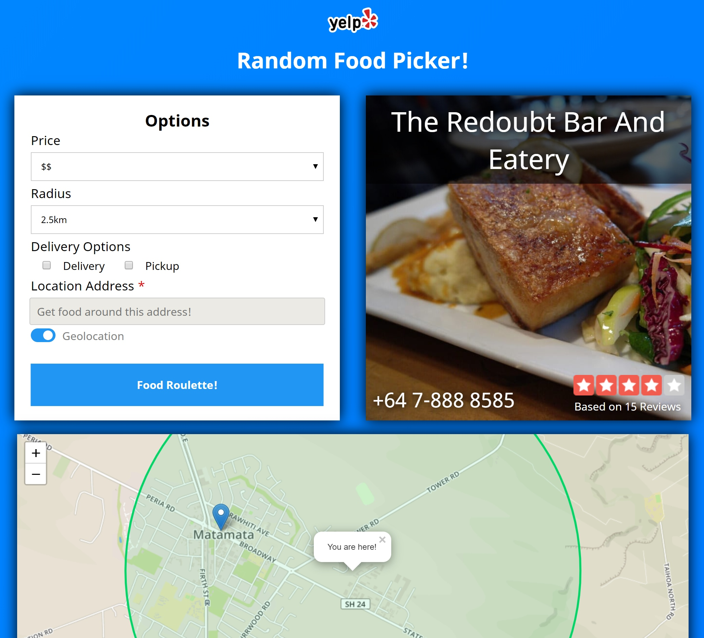

# Random Food Picker

A fun little web app written in [Vue](https://github.com/vuejs/vue) that picks a random food business around your location using the [Yelp Fusion API](https://www.yelp.com/fusion).

Blog post on the process of creating the application [https://blog.jeremyshaw.co.nz/2018/11/19/CORS-And-Hiding-Api-Keys/](https://blog.jeremyshaw.co.nz/2018/11/19/CORS-And-Hiding-Api-Keys/)


*Random Food Picker Screenshot*

This project uses Node v14.

## Commands

Project setup

``` bash
npm install
```

Compiles and hot-reloads for development

``` bash
npm run serve
```

Compiles and minifies for production

``` bash
npm run build
```

## Customization

Boolean `filter` field in App.vue data controls whether or not all of the random food picker filters are shown. Current set to false due to lack of support of many of the filters in many areas of the world, most notably in Europe.

## Contributing

I welcome contributions to Random Food Picker App. Feel free to create an issue regarding any bugs or desired features, and I'll respond when possible. If you want to contribute code, please fork this repository and create a pull request.

Please keep in mind that you will only be able to contribute to the App frontend. The only backend code is from using Firebase Functions, and I would like the Firebase Functions code to remain private for security reasons.